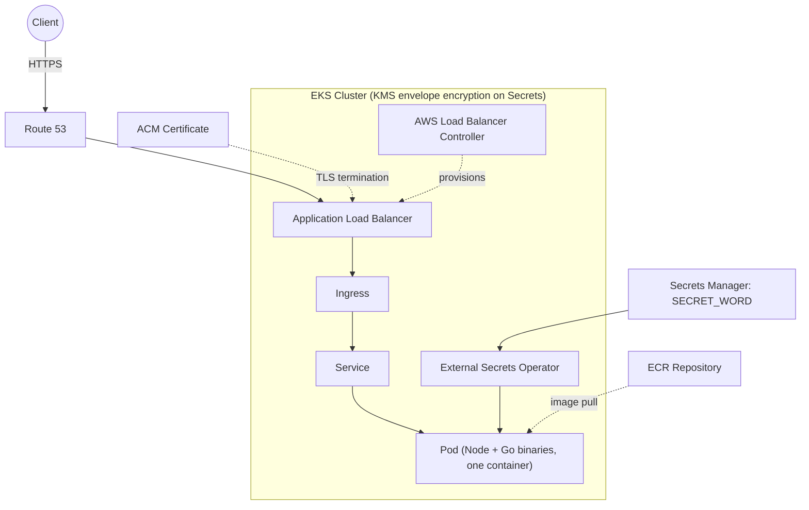

# Deployment

Terraform IaC for this submission lives under `terraform/`, starting
with [`terraform/bootstrap/`](terraform/bootstrap/README.md) which
provisions the S3 bucket used for the main stack's remote state. The
main stack itself (deploying the app, load balancer, and TLS) is a
separate, later piece of work.

## Architecture

The seed app (`src/000.js`) is a single Express process that shells out to
five opaque Go binaries in `bin/` via `child_process.exec()` — a local
subprocess spawn, not a network call. That makes it a monolith: one
container image holds the Node app and all the binaries together, with
no natural frontend/backend split to exploit architecturally.

### Design choices

- **Compute: EKS + Helm**, over ECS Fargate. Both are equally
  enterprise-standard; EKS was chosen to demonstrate Kubernetes/Helm
  depth relevant to this role, at the cost of more infrastructure surface
  (cluster, node group or Fargate profile, IRSA, ingress controller) than
  ECS would need for an app this small.
- **Networking:** a dedicated VPC (not the account default), spanning at
  least two AZs, with public subnets for the ALB and NAT gateways and
  private subnets for the EKS nodes/pods — the VPC CNI assigns pod IPs
  from the private subnet CIDR directly, so nodes never need a public IP.
  A single shared NAT gateway vs. one per AZ is a cost-vs-availability
  tradeoff left for the networking chunk to decide explicitly rather than
  default silently.
- **Ingress/load balancing:** the AWS Load Balancer Controller (installed
  via Helm) provisions an ALB from a Kubernetes `Ingress` resource. This
  satisfies the `/loadbalanced` check the same way an ALB would in an ECS
  design — by adding `X-Forwarded-*` headers to the request the app sees.
- **TLS:** a real domain is available, so TLS uses a public ACM
  certificate with Route 53 DNS validation, referenced on the Ingress via
  annotation — a browser-trusted cert for `/tls`, not a self-signed one.
- **Secrets:** `SECRET_WORD` lives in AWS Secrets Manager (chosen over SSM
  Parameter Store for the rotation story, at ~$0.40/mo) and is synced into
  the pod by the **External Secrets Operator (ESO)**, which materializes a
  native Kubernetes `Secret` wired in via `envFrom`/`secretKeyRef` —
  matching the app's `docker run -e` / env-var expectation with no extra
  plumbing, never baked into the image, satisfying `/secret_word` while
  matching the repo's "inject at runtime" standard. The alternative,
  the Secrets Store CSI driver, mounts secrets as files instead of
  creating a `Secret` object; bridging that back to an env var would need
  an init container or wrapper script, complexity this app has no use
  for. The standard objection to ESO ("plaintext Secrets sitting in
  etcd") is addressed at the right layer instead of avoided: **KMS
  envelope encryption is enabled on the EKS cluster's Kubernetes Secrets**
  (`encryption_config` on the cluster resource).
- **CI/CD:** the main app stack's `terraform apply` runs automatically in
  GitHub Actions on merge to `main`, via a least-privilege role scoped to
  just that stack's resources. `terraform/bootstrap/` is deliberately
  excluded from CI apply and stays a manual, human-only operation — it's
  the one-time bootstrap of the state backend those CI runs would
  otherwise depend on.

### Request flow

### Rollout

Built incrementally as separate branches/PRs: set up CI/CD →
containerize the app → push to ECR → networking foundation → EKS cluster
→ ingress path → TLS → secrets wiring → app Helm chart → final docs pass.
Each stage is verified against its corresponding quest route (see
**Verifying each quest stage** in `CLAUDE.md`) before the next is built on
top of it. Full detail per stage lives in
`docs/superpowers/plans/2026-07-28-deployment-roadmap.md`.
