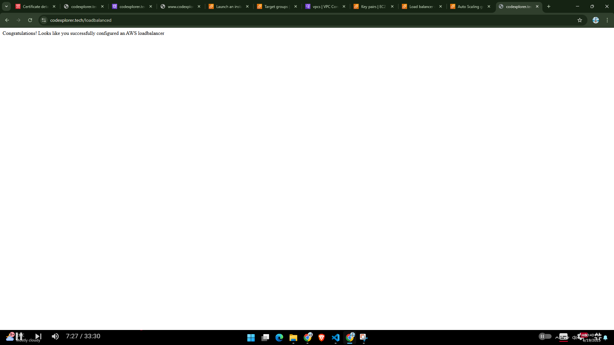
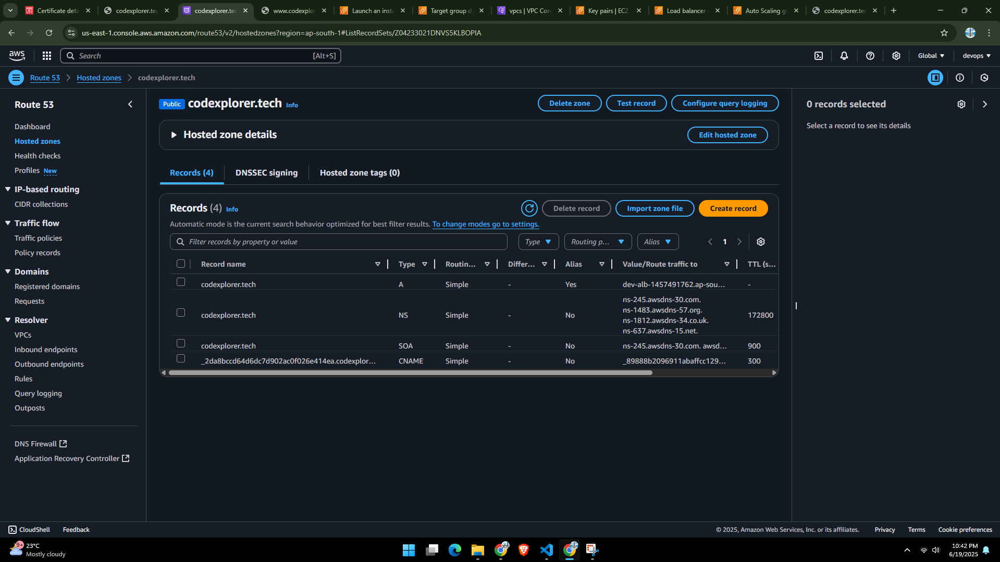
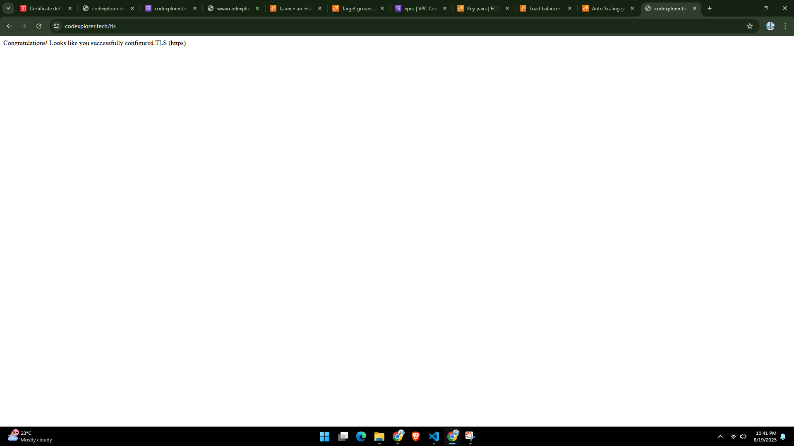

#  Node app Deployment – AWS & Terraform

 It's a simple yet complete example of how to deploy a Dockerized Node.js application on AWS using Terraform, following real-world DevOps practices.

---

##  What Does This Project Do?

This setup launches a Node.js application in a Docker container running on AWS EC2 instances, behind an Application Load Balancer (ALB). Everything is fully automated with Terraform.

Here's what you'll get:

- A VPC with two public subnets
- EC2 instances in an Auto Scaling Group
- Docker container running a Node.js app
- An Application Load Balancer with HTTPS (TLS)
- A custom domain name (e.g., `example.com`)
- DNS setup with Route 53
- Secrets securely passed as environment variables
- Infrastructure as Code (IaC) with modules

---

##  Tools & Technologies Used

- **AWS**: EC2, ALB, Route53, ACM, Auto Scaling, SSM
- **Terraform**: For automating infrastructure
- **Docker**: To containerize the app
- **Node.js**: Backend application
- **Git**: For version control

---

## 🌍 Live Access

Once deployed, the application will be accessible at:
[https://example.com](https://example.com)

---
##  Requirements Before You Start

Make sure you have the following ready:

1. **AWS account** with admin access
2. A **domain name** (e.g., from Hostinger or GoDaddy)
3. A **valid ACM certificate** for your domain in AWS
4. AWS CLI installed and configured
5. Terraform installed

##  Setup Instructions

### 1. Clone the repository

```bash
git clone https://github.com/Aadi-Sonwane/quest.git
cd quest/infra
```
### 2. Configure your AWS credentials
Make sure your AWS CLI is configured with the necessary permissions:

```bash
export AWS_ACCESS_KEY_ID="your-access-key"
export AWS_SECRET_ACCESS_KEY="your-secret-key"
export AWS_DEFAULT_REGION="ap-south-1"
```

### 3. Update the `terraform.tfvars` file
Edit the `terraform.tfvars` file to include your domain name and other configurations:
```hcl
prefix               = "dev"
region               = "ap-south-1"
vpc_cidr             = "10.0.0.0/16"
public_subnet_a_cidr = "10.0.1.0/24"
public_subnet_b_cidr = "10.0.2.0/24"
instance_type        = "t2.medium"
secret_word          = "test"
docker_image         = "aadus/node-app"
docker_image_tag     = "latest"
ami_id               = "ami-0f918f7e67a3323f0"
domain_name          = "example.com"
alternate_domain_names = ["www.example.com"]
acm_certificate_arn  = "arn:aws:acm:ap-south-1:-69ab0fdcadb4"
```

### 4. Initialize Terraform
Run the following command to initialize Terraform and download necessary providers:
```bash
terraform init
```
### 5. Plan the deployment
This will show you what resources will be created:
```bash
terraform plan
```
### 6. Apply the configuration
Run the following command to create the resources:
```bash
terraform apply
```
Type `yes` when prompted to confirm.
### 7. Access your application
Once the deployment is complete, you can access your Node.js application at:
[https://example.com](https://example.com)
### 8. Clean up resources
When you're done, you can destroy the resources to avoid unnecessary charges:
```bash
terraform destroy
```
---

### 9. Proof of Deployment
- #### 1. Proof of Deployment


- #### 2. Docker Container Verification


- #### 3. ALB Check Status


- #### 4. Route53 DNS Setup


- #### 5. tls Certificate Verification


- #### 5. secrets Verification

---
